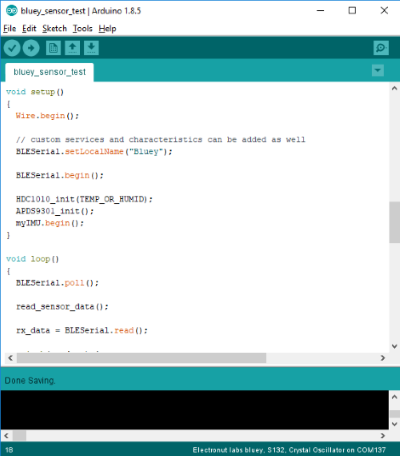
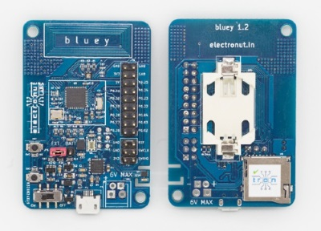

# ElectronutLabs_Bluey_Arduino_Library
Bluey library for use with Arduino.

 

## Examples

Bluey directory contains examples demonstrating the board's usage and functionalities. 

**bluey_sensor_test** example demonstrates the use of Nordic UART service to transmit temperature, humidity, ambient light, accelerometer and gyroscope readings from Bluey to nRF Connect mobile application on your smartphone.

## Usage

**Copy *Bluey* to Documents/Arduino/libraries directory.**

* Set the device in bootloader mode. To trigger bootloader, press and hold button1 **(SW3)** , press the Reset button **(RST)** and then release button1. More details on bootloader can be found at main Bluey [repository](https://github.com/electronut/ElectronutLabs-bluey)

* Go to: Tools > Boards. Select **Electronut labs Bluey**.

* Go to: Tools > Softdevice. Select **S132**.

* Ensure Low Frequency Clock is set to **Crystal Oscillator** under Tools menu.

* Select appropriate COM Port assigned to Bluey.

* Click on **Upload** under Sketch menu or use **Ctrl + U** combination to upload code to Bluey.

* Once the code is uploaded, perform a manual reset by pressing **RST** button once.

